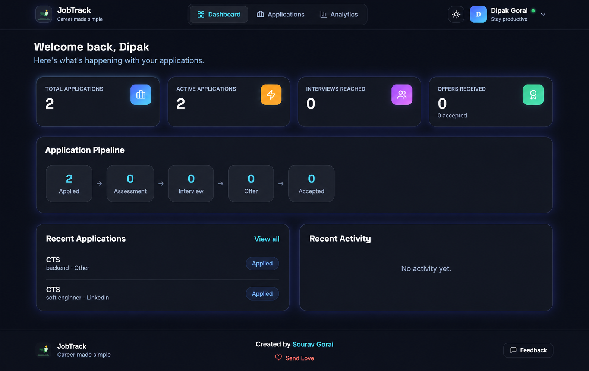
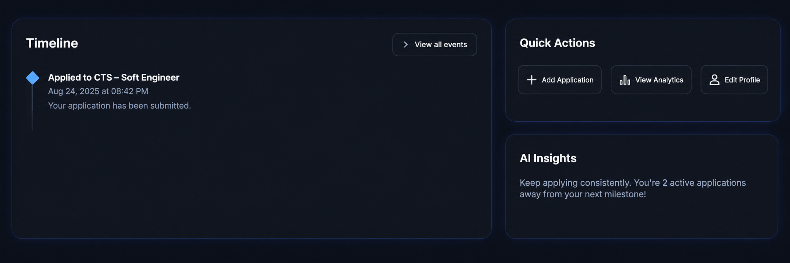
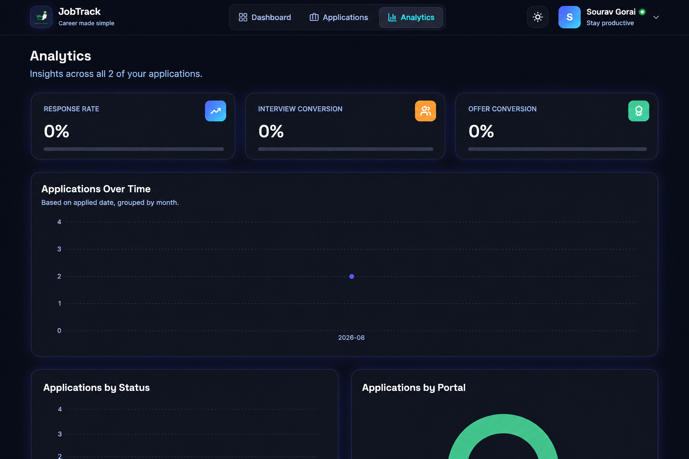
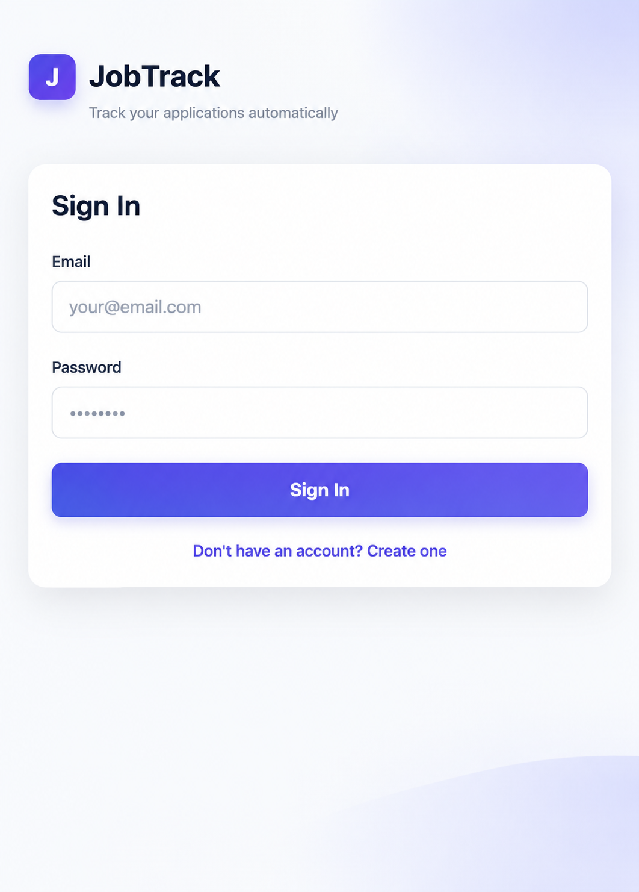
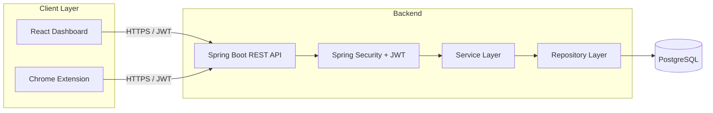

<div align="center">

# 🚀 JobTrack

### Automated Job Application Intelligence & Tracking Platform

*Stop maintaining a spreadsheet. Start tracking automatically.*

[](https://www.java.com)
[](https://spring.io/projects/spring-boot)
[](https://react.dev)
[](https://www.postgresql.org)
[](https://www.docker.com)
[](LICENSE)

[Live Demo](#) · [Report Bug](../../issues) · [Request Feature](../../issues)

</div>

---

## 📖 Overview

Job hunting across LinkedIn, Naukri, Internshala, Unstop, and dozens of company career pages means one thing: your application data is scattered everywhere except where you actually need it. **JobTrack** fixes that.

Instead of manually typing every company, title, and status into a spreadsheet, JobTrack gives you a **browser extension** that reads the job posting you're looking at, lets you confirm the details in one click, and saves it straight to your personal dashboard — automatically defaulting to "Applied" the moment you say so.

> **Core philosophy:** the user should not have to manually maintain their job tracker. Every feature in this project is built around minimizing manual data entry, not adding more of it.

This isn't a generic CRUD "job management system" — it's an automation-first platform, with a clean, modern, dark/light-mode interface designed to feel like a real product, not a class assignment.

---

## 📸 Screenshots

> Replace these placeholders with real screenshots before publishing — a README with actual visuals of the dashboard, application detail/timeline view, analytics charts, and the extension popup converts far better than text alone.

| Dashboard | Application Timeline |
|---|---|
|  |  |

| Analytics | Browser Extension |
|---|---|
|  |  |

---

## ✨ Features

### 🔐 Authentication & Security
- JWT-based authentication with BCrypt password hashing
- Role-based access control (`USER` / `ADMIN`)
- Every API endpoint scoped to the authenticated user — no data leakage between accounts, enforced at the query level

### 📋 Application Management
- Full CRUD for job applications: company, title, URL, portal, location, employment type, salary/stipend, job description, resume used, recruiter details, and follow-up dates
- **Duplicate prevention** — a unique constraint on (user, job URL) stops the same job from being tracked twice, whether added manually or via the extension
- Backend-enforced **status lifecycle** (`SAVED → APPLIED → ASSESSMENT → INTERVIEW → OFFER → ACCEPTED / REJECTED / WITHDRAWN`) — invalid jumps (like `APPLIED → ACCEPTED`) are rejected server-side, not just hidden in the UI

### 🕒 Smart Timeline
- Every status change and manually logged event builds an append-only, chronological timeline per application — "what happened," kept separate from "what's the status now"
- Manually add, edit, or delete your own timeline notes (e.g. "Recruiter call scheduled") — while system-generated events stay protected as an untampered audit trail

### 🔍 Search, Filter & Pagination
- Full-text search across company, title, and job description
- Filter by status, portal, location, employment type, and date range — all combinable, all backend-paginated (never loads your entire history into the browser at once)

### 📊 Analytics Dashboard
- Response rate, interview conversion rate, and offer conversion rate, computed from real event history — not just current status
- Visual breakdowns by status, by portal, and applications-over-time, rendered with interactive charts
- A live pipeline view showing exactly how many applications are sitting at each stage

### 🧩 Browser Extension
- One click on any job page (LinkedIn, Naukri, Internshala, Unstop, or a generic company careers page) extracts the job title, company, and location automatically using page-specific parsers with a structured-data (JSON-LD) fallback for unknown sites
- Anything the page doesn't reveal is simply left blank for quick manual entry — the extension never blocks you from saving
- One click — **"I Applied"** — sends it straight to your dashboard, authenticated and duplicate-checked before it ever hits the database

### 🛡️ Admin Panel
- Role-protected (`ADMIN`-only, enforced on the backend, not just hidden in the UI) overview of total users, applications, feedback, and community engagement
- Read access to all user feedback submissions

### 🎨 Modern UI/UX
- Fully responsive, professionally designed interface with true dark/light mode
- Clean navigation, contextual empty states, and inline validation everywhere — no dead-end error pages

---

## 🛠️ Tech Stack

| Layer | Technology |
|---|---|
| **Backend** | Java 17 · Spring Boot 3 · Spring Security 6 · Spring Data JPA / Hibernate · PostgreSQL · Maven · JWT (jjwt) · Bean Validation |
| **Frontend** | React 18 · Vite · Tailwind CSS · React Router · Axios · Recharts · lucide-react |
| **Browser Extension** | Chrome Manifest V3 · Vanilla JavaScript (zero build step) |
| **DevOps** | Docker (multi-stage builds) · Docker Compose (local dev) · Render (deployment — Docker Web Service + Static Site) |

---

## 🏗️ Architecture



The backend is a clean, modular monolith — no unnecessary microservices, no premature complexity. Business rules (like valid status transitions) live in one place and are reused by every entry point, so the API, the UI, and future automation can never disagree on what's a valid action.

---

## 📁 Project Structure

```
job-tracker/
├── jobtrack-backend/          # Spring Boot REST API
│   ├── src/main/java/com/jobtrack/
│   │   ├── controller/        # REST endpoints
│   │   ├── service/           # Business logic
│   │   ├── repository/        # Data access (Spring Data JPA)
│   │   ├── entity/            # JPA entities
│   │   ├── dto/                # Request/response contracts
│   │   ├── security/          # JWT + Spring Security config
│   │   └── exception/         # Centralized error handling
│   └── Dockerfile
│
├── jobtrack-frontend/         # React dashboard
│   ├── src/
│   │   ├── pages/              # Route-level views
│   │   ├── components/        # Reusable UI pieces
│   │   ├── api/                 # Backend API client layer
│   │   └── context/            # Auth & theme state
│   └── Dockerfile
│
└── jobtrack-extension/        # Chrome extension (Manifest V3)
    ├── popup/                  # Extension UI
    ├── content-scripts/        # Job-detail extraction per portal
    └── background/             # Service worker
```

---

## 🚀 Getting Started

### Prerequisites
- Java 17+
- Node.js 18+
- PostgreSQL 14+ (or Docker)
- Maven
- Google Chrome (for the extension)

### Option A — Docker Compose (fastest, runs the full stack)

```bash
git clone https://github.com/SouravGorai2004/Job-Tracker.git
cd Job-Tracker
docker compose up --build
```
Frontend: `http://localhost:5173` · Backend: `http://localhost:8081`

### Option B — Run each part manually

**1. Backend**
```bash
cd jobtrack-backend
# create a PostgreSQL database named `jobtrack`
mvn spring-boot:run
```
Runs on `http://localhost:8081`.

**2. Frontend**
```bash
cd jobtrack-frontend
npm install
npm run dev
```
Runs on `http://localhost:5173`.

**3. Browser Extension**
```text
1. Open chrome://extensions
2. Enable "Developer mode" (top right)
3. Click "Load unpacked"
4. Select the jobtrack-extension folder
```

---

## ⚙️ Environment Variables

**Backend** (`application.properties` / env vars)

| Variable | Description | Default |
|---|---|---|
| `SPRING_DATASOURCE_URL` | JDBC connection string | `jdbc:postgresql://localhost:5432/jobtrack` |
| `SPRING_DATASOURCE_USERNAME` | Database username | `postgres` |
| `SPRING_DATASOURCE_PASSWORD` | Database password | `postgres` |
| `JWT_SECRET` | Secret key for signing JWTs (use a long random value in production) | — |
| `PORT` | Port the server binds to | `8081` |

**Frontend**

| Variable | Description | Default |
|---|---|---|
| `VITE_API_BASE_URL` | Base URL of the deployed backend API | `http://localhost:8081/api` |

---

## 🔌 API Overview

| Group | Endpoints | Description |
|---|---|---|
| Auth | `POST /api/auth/register`, `/login` | Registration & JWT login |
| Applications | `GET/POST/PUT/DELETE /api/applications` | Core CRUD |
| Status | `PATCH /api/applications/{id}/status` | Rule-validated status transitions |
| Timeline | `GET/POST/PUT/DELETE /api/applications/{id}/events` | Application event history |
| Search | `GET /api/applications/search` | Filtered, paginated results |
| Analytics | `GET /api/analytics` | Aggregated insights |
| Admin | `GET /api/admin/stats` | Admin-only platform stats |

---

## 👤 How to Use

1. **Register** an account on the web dashboard.
2. **Install the browser extension** and sign in with the same account.
3. Browse job listings as normal — on any supported portal, click the JobTrack icon.
4. Review the auto-detected details (fill in anything missing) and hit **I Applied**.
5. Open your dashboard to see the application appear instantly — with its status, timeline, and pipeline position already tracked.
6. Update status as you progress (Assessment → Interview → Offer), add notes to the timeline, and check **Analytics** to see your response and conversion rates over time.

---

## 🗺️ Roadmap

These are the next logical extensions to the platform — genuinely planned, not yet built:

- [ ] **Gmail integration** — one-time OAuth connection to automatically detect confirmation, assessment, interview, and rejection emails
- [ ] **Automatic status detection** — rule-based (with an LLM fallback for ambiguous emails) matching of incoming emails to the correct application, with a confidence-tiered system to avoid false updates
- [ ] **Resume file storage** — move from a resume label field to actual file uploads with per-application association
- [ ] **More portal extractors** — Indeed, Glassdoor, Wellfound, and easy community-contributed extractors for new job sites
- [ ] **Recruiter directory** — reusable recruiter contact records across applications
- [ ] **Mobile app** — a lightweight companion for on-the-go status checks

Contributions toward any of these are very welcome.

---

## 🤝 Contributing

Contributions make the open-source community an amazing place to learn and build. Any contribution you make is **greatly appreciated**.

1. Fork the project
2. Create your feature branch (`git checkout -b feature/AmazingFeature`)
3. Commit your changes (`git commit -m 'Add some AmazingFeature'`)
4. Push to the branch (`git push origin feature/AmazingFeature`)
5. Open a Pull Request

---

## 📄 License

Distributed under the MIT License. See `LICENSE` for more information.

---

## 📬 Contact & Author

**Sourav Gorai**

[](https://www.linkedin.com/in/sourav-gorai-010042270)
[](https://github.com/SouravGorai2004)
[](https://instagram.com/i_am_sourav_2004)
[](https://portfolio-frontend-w0uf.onrender.com/)

---

<div align="center">

### ⭐ If this project helped you, consider giving it a star!

*Built with ❤️ — and if you're using JobTrack itself, there's a "Send Love" button in the footer for a reason 😉*

</div>
